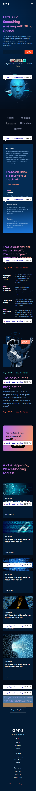

# :closed_book: GPT-3 (Ui/Ux Figma to Code)

### _GPT-3 Website, built using React, React icons, Netlify !!_

### Link :link: https://rak-gpt3.netlify.app/

## Interface

## Mobile Interface

## Run Locally

  - Run This command `https://github.com/developer-rak/gpt3.git`
  - You are now in the dev environment and you can play around

## ✨ Features

  - What GPT3
  - Open AI
  - Accessibility Optimized
  - Fully Responsive for BigScreen, Tablet and Mobile
  - Open Source (Tweak it and use it)

## ⚙️ Tech Stack
  - HTML5
  - CSS3
  - React
  - React-icons
  - Netlify
